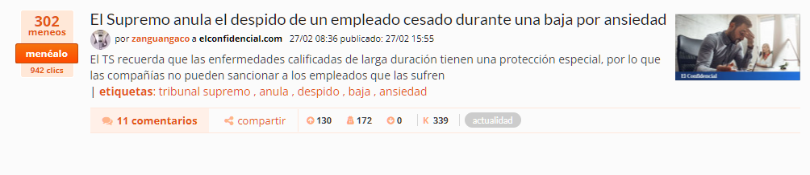
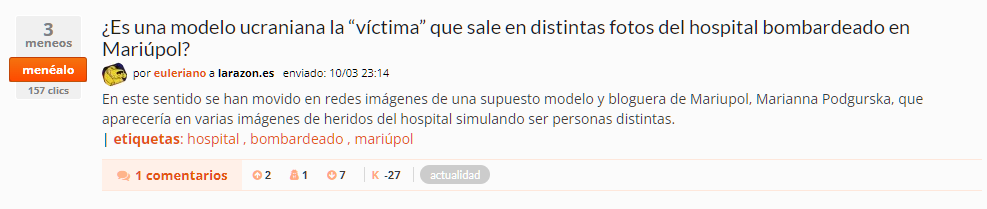
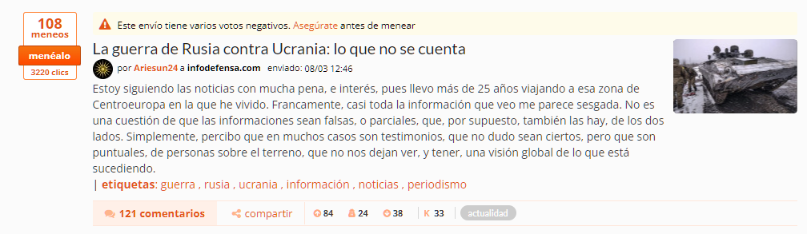
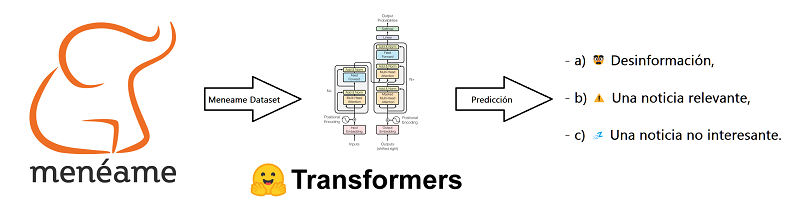

# 🪄💪🥸📰 Ayudando a luchar contra la desinformación, utilizando un Modelo Predictivo entrenado con noticias de meneame.net

*\#NLP #Transformers #RoBERTa #AWS #Intel #Hackathon #hackathoniberia*

by [@javichur](https://github.com/javichur) (https://javiercampos.es)

---

## 1.¿Cuál es el desafío elegido y el valor de la solución en su resolución?

## ❓ Problema que se quiere resolver

La desinformación (o *fake news*) es la información errónea que se da, generalmente de manera intencionada.

Esta desinformación perjudica frecuentemente a **colectivos desfavorecidos**, como inmigrantes, refugiados, pobres, niños, adolescentes, ancianos, mujeres víctimas de violencia de género, personas con discapacidad...

##  🏋️‍♀️ Impacto Social

- Las noticias falsas se ensañan con los **refugiados**: https://www.cear.es/noticias-falsas-refugiados/

- Según un estudio de la UC3M, La mitad de los **estudiantes de ESO** no distingue las “fake news”: https://www.uc3m.es/ss/Satellite/UC3MInstitucional/es/Detalle/Comunicacion_C/1371320130990/1371215537949/La_mitad_de_los_estudiantes_de_ESO_no_distingue_las_%E2%80%9Cfake_news%E2%80%9D

- El 86% de la **población española** se cree las noticias falsas, pese a que el 60% cree que sabe detectarlas: https://www.simplelogica.com/wp-content/uploads/2018/10/estudiopescanova.pdf

- **Una de cada cuatro jóvenes** se sienten físicamente inseguras por culpa de la desinformación: https://www.rtve.es/noticias/20211004/informe-desinformacion-mujeres-jovenes-salud-mental-participacion/2179620.shtml

## 💡 Solución propuesta

Nuestro objetivo es, a partir de una secuencia de entrada (ejemplo: el título de una noticia), ayudar a identificar si es potencialmente:

- a) 🥸 Desinformación,
- b) ⚠️ Una noticia relevante,
- c) 💤 Una noticia no interesante.

Para ello, primero generaremos un Dataset de noticias de Meneame.net, las cuales están accesibles de forma pública a través de internet. Meneame.net es un portal donde los usuarios envían noticias y los usuarios votan las más interesantes (con "meneos" positivos o votos negativos).

En Meneame.net hay casi 4 Millones de noticias, cada una de las cuales puede estar en 1 de estos estados:

- **"Publicada"**, es una noticia que ha recibido muchos votos positivos y pocos votos negativos en proporción, por tanto se considera una noticia con probabilidad muy alta de ser veraz y relevante. Un ejemplo:

- **"Descartada"**: es una noticia que ha recibido muchos votos negativos y ya no aparece en la web ni puede recibir más votos. Suele ser una noticia falsa, clickbait (que solo busca el click) o duplicada. Un ejemplo:

- **Encolada (pendiente de publicarse en portada)**: es una noticia que aún no ha sido publicada en la portada porque no ha recibido suficientes votos positivos en comparación con el nº de votos negativos. En este estado pueden haber noticias de 2 tipos: noticias **poco interesantes (sin casi votos)** o noticias **polémicas (muchos votos positivos y muchos votos negativos)**. Los 2 ejemplos:

- **"Abuse"**: son las noticias que incumplen las normas de uso de Meneame (ejemplo: spam). Existen muy pocas noticias en esta categoría, omitiremos esta categoría en el entrenamiento de la red neuronal.

- **Auto descartadas**: noticias que el propio usuario que las ha enviado las ha descartado después (normalmente, al darse cuenta que otro usuario la había publicado antes). Hay muy pocas noticias en esta categoría, omitiremos esta categoría en el entrenamiento de la red neuronal.

En este proyecto se propone utilizar **Natural language processing (NLP)**, en concreto una red neuronal de tipo **Transformer**, para la clasificación de futuras noticias.

Como Dataset de entrenamiento se utilizarán las noticias de Meneame.net, las cuales son públicas. Se ha generado un **Dataset** con las noticias, y han sido automáticamente clasificadas en categorías (categorías: relevante, no relevante, polémica, descartada) a partir de las columnas del dataset (votos, votos negativos, estado).

Un esquema resumen:

---

## 2.¿Qué servicios funcionan con AWS e Intel y por qué fueron elegidos?

La solución se implementa en Amazon Web Services (**AWS**) utilizando tecnología **Intel**, y participa en el Hackathon For Good https://www.hackathoniberia.com/

Para ejecutar el cuaderno jupyter, se utiliza el servicio **Amazon SageMaker Notebook**:

- Durante la generación del Dataset no es necesario utilizar instancias de cómputo con altas prestaciones. Por tanto, se busca el tipo de instancia más económico (o que entra en free tier). Se escoge instancia Micro de tipo T3.

- Pero durante el entrenamiento del Modelo sí es necesario utilizar una instancia EC2 con GPU y capaz de trabajar con GBs de información, como las instancias Intel que utilizaremos. Concretamente, se busca la mejroa relación prestaciones/precio y se escoge la instancia **p3.2xlarge** que tiene una GPU con 8GB, 61GB de RAM y tecnología Intel (Intel AVX, Intel AVX2, Intel Turbo).

Una vez generado el Dataset, éste se copia desde el notebook en **Amazon S3**, para conservarlo aún después de finalizar la instancia EC2 de SageMaker.

Por último, tras entrenar el modelo y probarlo con nuevas noticias (evaluación del modelo), se intentará **publicar utilizando Amazon SageMaker**, para que otras personas puedan inferir resultados vía API.

Nota: también he utilizado **Amazon SageMaker Studio Canvas**, como una forma rápida y no-code de buscar correlaciones entre diferentes columnas del dataset generado. Pero finalmente todo el análisis de datos realizado está en el jupyter notebook también.

---